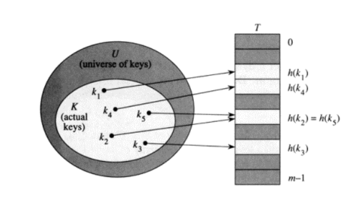

# Hash Function

**해시 함수**(Hash function)는 임의의 길이의 데이터를 고정된 길이의 데이터로 매핑하는 함수이다.

해시 함수에 의해 얻어지는 값은 **해시 값**, **해시 코드**, 해시 체크섬 또는 간단하게 **해시**라고 한다. 

해시 테이블이라는 자료 구조에 사용되며, 매우 빠른 데이터 검색을 위한 컴퓨터 소프트웨어에 널리 사용된다.

### Hash Table

해시 테이블은 key-value 쌍에서 key값을 테이블에 저장할 때, Direct Addressing Table과 달리 key값을 함수를 이용해 계산을 수행 한 후, 그 결과값을 배열의 인덱스로 사용하여 저장하는 방식이다. 여기서 key값을 계산 하는 함수는 해시 함수라고 부른다.

해시 함수는 입력으로 key를 받아, 0부터 배열의 크기와 -1 사이의 값을 출력한다. 해시에 대한 첫 정의대로 임의의 숫자를 배열의 크기 만큼으로 변환 시킨 것이다.

이 경우 k값이 h(k)로 해쉬되었다고 하며, h(k)는 k의 해시값이다.

### STL

**unordered_set, unordered_map**