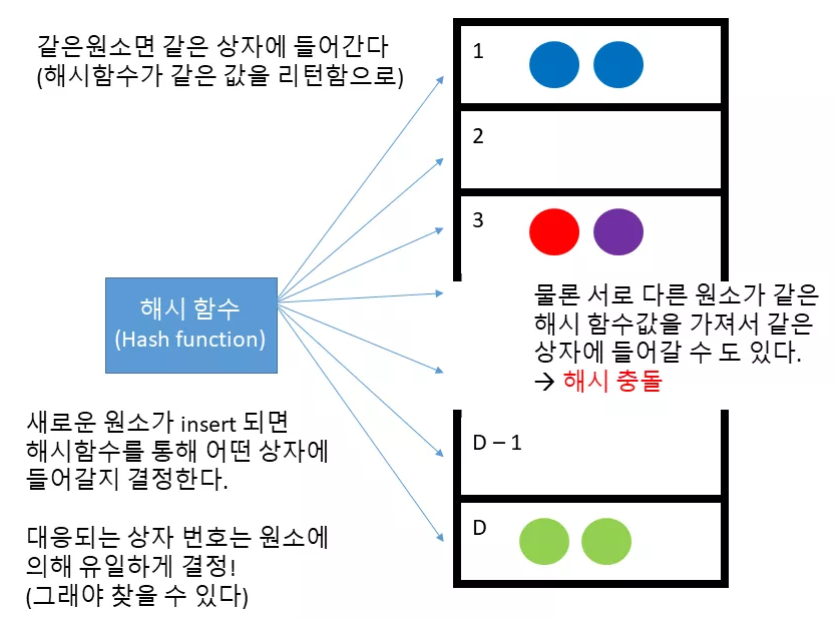
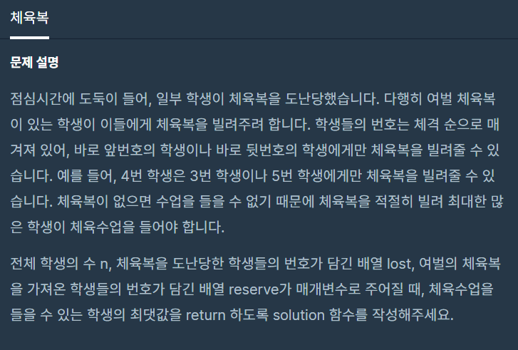
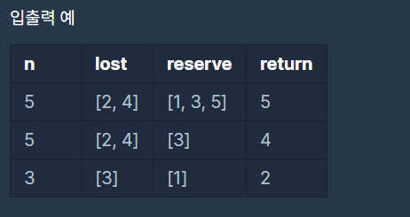

# Set

자료구조 공부

잠깐 기초 상식

→ 시퀀스 컨테이너들 : vector, list, deque

→ 연관 컨테이너들 : map, set

연관 컨테이너는 시퀀스 컨테이너와는 다르게 키(key) - 값(value) 구조를 가진다. 다시 말해 특정한 키를 넣으면 이에 대응되는 값을 돌려준다. 물론 템플릿 라이브러리 이기 때문이 키와 값 모두 임의의 타입의 객체가 될 수 있다.

**연관 컨테이너는 키를 바탕으로 이에 대응되는 값을 얻을 수 있는 구조이다.**

주어진 자료에서 보통 두 가지 종류의 질문을 할 수 있습니다.

- 쿠키가 데이터에 존재하나요? (특정 키가 연관 컨테이너에 존재하는지 유무) → True
- 만약 존재한다면 이에 대응되는 값이 무엇인가요? (특정 키에 대응되는 값이 무엇인지 질의) → 46

전자의 경우 set/multiset, 후자의 경우가 map/multimap 이다

# 📜 Description

map과 마찬가지로 이진 탐색 트리 자료구조를 사용한다. map과 달리 key와 value 개념으로 나뉘어 있지 않다. key만 저장하고 정렬한다. *중복으로 저장할 수 없다* 하지만 중복으로 사용하고 싶다면 **multiset**을 사용해야한다.

또는 집합 개념으로, 원소라는 구별되는 객체들이 연관되어 모인 것이다.(서로 다른 연관된 원소들의 순서 없는 모임이다.)

- 중복 허용 x
- 객체들에 데이터가 들어가 있는 거긴 때문에 검색하고 싶으면 iterator

    for(set::iterator IterPos = set1.begin(); IterPos != set1.end(); ++IterPos )
       {
          cout << *IterPos << endl;
       }

`이런 **조건**` 일 때 사용하면 좋다

- 정렬이 필요 (집합으로 쓰일 때는 상관 없을 수도 있다 stl: unordered_set)
- key 존재 유무
- 많은 자료 저장하고 검색 속도가 빨라야 할 때

### 주요 메서드

[Members](https://www.notion.so/febed58e8afd48869c4160b0a84778af)

자료 추가 할 때, **insert**

## unordered_set

정렬되지 않은 set

셋이나 맵 같은 경우 원소들이 제대로 정렬되어서 내부에 저장되지만 이 컨테이너 같은 경우는 원소들이 순서대로 정렬되서 들어가지 않는다.

그래서 **insert, find, erase** 가 O(1)으로 수행된다. (그냥 셋과 맵에서는 O(logN) ) 상수 시간으로 원소를 삽입하고 찾고 삭제할 수 있다.

원소를 삽입하거나 검색 하기 위해 먼저 **해시 함수**라는 것을 사용합니다

(사실 그래서 원래 hashset 이나 hashmap 이란 이름을 붙이려고 했지만 이미 이러한 이름을 너무 많이 사용하고 있어서 충돌을 피하기 위해 저런 이름을 골랐다고 한다).

**해시 함수란 임의의 크기의 데이터를 고정된 크기의 데이터로 대응시켜주는 함수라고 볼 수 있습니다. 이 때 보통 고정된 크기의 데이터라고 하면 일정 범위의 정수값을 의미합니다.**

### Reference

[씹어먹는 C++ -](https://modoocode.com/224)

# ✔Example : 체육복

### 제한사항

- 전체 학생의 수는 2명 이상 30명 이하입니다.
- 체육복을 도난당한 학생의 수는 1명 이상 n명 이하이고 중복되는 번호는 없습니다.
- 여벌의 체육복을 가져온 학생의 수는 1명 이상 n명 이하이고 중복되는 번호는 없습니다.
- 여벌 체육복이 있는 학생만 다른 학생에게 체육복을 빌려줄 수 있습니다.
- 여벌 체육복을 가져온 학생이 체육복을 도난당했을 수 있습니다. 이때 이 학생은 체육복을 하나만 도난당했다고 가정하며, 남은 체육복이 하나이기에 다른 학생에게는 체육복을 빌려줄 수 없습니다.

### 입출력 예 설명

**예제 #11번** 

학생이 2번 학생에게 체육복을 빌려주고, 3번 학생이나 5번 학생이 4번 학생에게 체육복을 빌려주면 학생 5명이 체육수업을 들을 수 있습니다.

**예제 #23번** 

학생이 2번 학생이나 4번 학생에게 체육복을 빌려주면 학생 4명이 체육수업을 들을 수 있습니다.

### Answer

    #include <string>
    #include <vector>
    #include <unordered_set>
    #include <set>
    
    using namespace std;
    
    int solution(int n, vector<int> lost, vector<int> reserve) {
    	int answer = 0;
    	unordered_set<int> l(lost.begin(), lost.end());
    	set<int> r;
    	unordered_set<int> inter;
    	for(auto& x : reserve){
    		if(l.find(x) == l.end()) r.insert(x);
    		else inter.insert(x);
    	}
    	for(auto& x :inter)l.erase(x);
    	for(auto& x: r){
    		if(l.find(x-1) != l.end()) l.erase(x-1);
    		else if(l.find(x+1) != l.end()) l.erase(x+1);
    	}
    	answer = n - l.size();
    	return answer;
    }